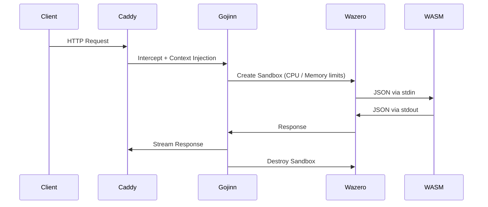

# 🧞 Gojinn
[](https://pkg.go.dev/github.com/pauloappbr/gojinn)

[]()
[](https://wazero.io)
[](https://github.com/sponsors/pauloappbr)

> **A Sovereign, In-Process Serverless Runtime for Caddy**  
> Execute untrusted code securely with WebAssembly — no containers, no orchestration, no control plane.

Gojinn is a **high-performance WebAssembly runtime embedded directly into the Caddy web server**.  
It allows you to run isolated, deterministic functions *inside the HTTP request lifecycle* — safely and with near-native performance.

---

## 🔑 What Gojinn Is (and Is Not)

### ✅ Gojinn is
- A **WASM-based serverless runtime**
- **Single-binary**, self-hosted, and auditable
- Deterministic, sandboxed, and capability-based
- Designed for **sovereign infrastructure** and edge environments

### ❌ Gojinn is NOT
- A container orchestrator
- A Kubernetes replacement
- A managed cloud service
- A general-purpose VM or process supervisor

> Gojinn executes **code and events** — not infrastructure.

---

## 🚀 Why Gojinn?

Modern serverless stacks suffer from:
- cold starts
- idle resource waste
- infrastructure sprawl
- opaque control planes
- vendor lock-in

Gojinn takes a different approach:

- **In-process execution** → no network hops, no sidecars
- **Zero idle cost** → no requests, no memory usage
- **Strong isolation** → every request runs in a fresh WASM sandbox
- **Opinionated design** → fewer knobs, more correctness
- **Open & Sovereign** → Apache-2.0, self-hosted, auditable

---

## ⚡ Performance at a Glance

| Metric | Docker (Alpine/Go) | Gojinn (WASM) |
|------|-------------------|---------------|
| Artifact Size | ~20 MB image | ~3 MB binary |
| Execution Model | Persistent daemon | Ephemeral sandbox |
| Idle Resource Usage | Always-on | Zero |
| Cold Start | ~1500ms | **<1ms** |

> Gojinn prioritizes **predictable latency and isolation** over long-lived processes.

Detailed benchmarks: [`docs/benchmark.md`](docs/benchmark.md)

---

## 🧠 Core Design Invariant

> **All user code executes inside a deterministic, isolated, ephemeral WASM sandbox and is never trusted by default.**

This invariant is **non-negotiable** and enforced by governance.  
Any feature or contribution that violates it will be rejected.

See: [`GOVERNANCE.md`](GOVERNANCE.md)

---

## 🏗 High-Level Architecture

Gojinn runs **inside Caddy**, not behind it.



Architecture details: `docs/concepts/architecture.md`

## 🛠 Installation

Gojinn is distributed as a Caddy plugin.

### Using xcaddy (recommended)

```bash
xcaddy build \
  --with github.com/pauloappbr/gojinn
```

## ⚙️ Configuration (Caddyfile)

```caddy
{
    order gojinn last
    admin :2019
}

:8080 {
    handle /api/* {
        gojinn ./functions/processor.wasm {
            timeout 2s
            memory_limit 128MB

            env DB_HOST "localhost"
            env API_KEY {env.SECRET_KEY}
        }
    }
}
```

Full reference: `docs/reference/caddyfile.md`

## 🧩 Writing Functions (The Contract)

Gojinn uses a strict JSON protocol over stdin/stdout.

- `stdin` → request context (JSON)
- `stdout` → response (JSON)
- `stderr` → logs only

Language support is polyglot via WASM:

- Go
- Rust
- Zig
- C / C++
- Swift (experimental)

Contract definition: `docs/concepts/contract.md`

## 📊 Observability

Built-in, no sidecars required:

- Metrics → Prometheus
- Tracing → OpenTelemetry
- Logs → Structured, via Caddy

Metrics endpoint:

```bash
http://localhost:2019/metrics
```

## 📚 Documentation

- Getting Started
- Guides
- Concepts
- Use Cases

## 🧭 Project Direction

- Roadmap
- Manifesto
- Governance

Gojinn is built with long-term correctness, not short-term convenience.

## 🤝 Community & Support

- Contributions
- Support policy
- Security issues

## 📄 License

Apache License 2.0  
See LICENSE
