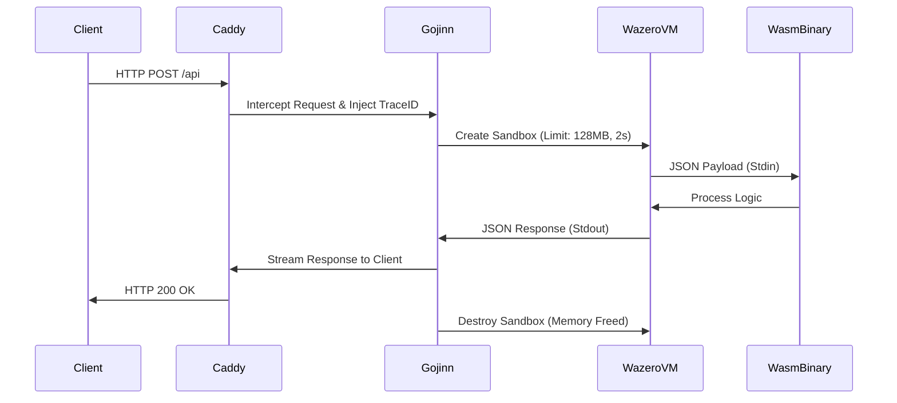

# 🧞 Gojinn

> **In-Process Serverless Runtime for Caddy Web Server** > Run Go, Rust, and Zig code directly inside your HTTP request flow with WebAssembly.

[](https://pkg.go.dev/github.com/pauloappbr/gojinn)
[]()
[](https://wazero.io)
[](https://github.com/sponsors/pauloappbr)

---

## 🚀 Why?

Traditional Serverless (AWS Lambda) or Containerization (Docker) suffers from **Cold Starts** (latency to spin up) and high idle resource consumption.

**Gojinn** brings the compute to the data:

- **Zero Infrastructure:** No Docker daemon, no Kubernetes, no sidecars.
- **Ultra-Low Latency:** Cold starts in **~1.3ms** (vs 2000ms+ for Docker).
- **Safety:** Each request runs in a strict, isolated WebAssembly sandbox.
- **Observability:** Native Prometheus metrics, distributed tracing, and structured logging.
- **Polyglot:** Write your handler in Go, Rust, Zig, Swift, or C++.

---

## ⚡ Benchmarks: Docker vs Gojinn

We compared a standard **Docker** container (running as a daemon) against **Gojinn** (spinning up a fresh sandbox per request).

| Metric | Docker Container (Alpine/Go) | Gojinn (Wasm/Go) | The Verdict |
|--------|----------------------|---------------------|--------|
| **Artifact Size** | 20.6 MB (Image) | 3.0 MB (Binary) | 🏆 **Gojinn (6.8x smaller)** |
| **Execution Model** | Persistent Daemon (consumes RAM while idle) | Ephemeral Sandbox (0 RAM while idle) | 🏆 **Gojinn** |
| **Request Latency** | ~9ms (Warm State) | ~13ms (Cold Start State) | 🤝 **Tie** (Imperceptible difference) |
| **Cold Start** | ~1500ms (Container boot) | **<1ms** (Wazero init) | 🏆 **Gojinn** |

> **Note:** Gojinn achieves near-native performance while providing complete isolation for every single request. If no requests are coming in, Gojinn consumes **zero CPU/Memory** resources for the handler.

---

## 🏗 Architecture

Unlike a reverse proxy that sends traffic to a backend service, **Gojinn** executes the binary *inside* the Caddy process memory space using **wazero**.



## 🛠 Installation

You need to build Caddy with this plugin.

### Using xcaddy (Recommended)

```bash
# Using xcaddy (Recommended)
xcaddy build \
    --with github.com/pauloappbr/gojinn
```

Or manually with Go:

```bash
go install github.com/caddyserver/xcaddy/cmd/xcaddy@latest
xcaddy build --with github.com/pauloappbr/gojinn
```
## ⚙️ Configuration (Caddyfile)

⚠️ **Important:** You must define the execution order globally to avoid directive errors.

```caddyfile
{
    order gojinn last
    admin :2019 # Required for Prometheus Metrics
}

:8080 {
    handle /api/* {
        gojinn ./functions/processor.wasm {
            # Security Limits (Phase 2 Features)
            timeout 2s
            memory_limit 128MB 

            # Environment Injection
            env DB_HOST "localhost"
            env API_KEY {env.SECRET_KEY}
            
            args --verbose
        }
    }
}
```
## 📝 Writing a Function (The Contract)

Gojinn uses a strict JSON Protocol over Stdin/Stdout. Your function must read a JSON object and reply with a JSON object.

### Golang Example

```go
package main

import (
    "encoding/json"
    "os"
)

// 1. Input Structure (Received from Gojinn)
type Request struct {
    Method  string              `json:"method"`
    URI     string              `json:"uri"`
    Headers map[string][]string `json:"headers"`
    Body    string              `json:"body"`     // Raw payload string
    TraceID string              `json:"trace_id"` // Distributed Tracing ID
}

// 2. Output Structure (Sent back to Gojinn)
type Response struct {
    Status  int                 `json:"status"`
    Headers map[string][]string `json:"headers"`
    Body    string              `json:"body"`
}

func main() {
    // A. Parse Input (Stdin)
    var req Request
    if err := json.NewDecoder(os.Stdin).Decode(&req); err != nil {
        return // Handle error
    }
    
    // B. Logic (Logs go to Stderr)
    // fmt.Fprintf(os.Stderr, "[%s] Processing...\n", req.TraceID)
    
    // C. Write Output (Stdout)
    resp := Response{
        Status: 200,
        Headers: map[string][]string{"Content-Type": {"text/plain"}},
        Body: "Hello from Gojinn! Trace: " + req.TraceID,
    }
    json.NewEncoder(os.Stdout).Encode(resp)
}
```

### Compile to WASM

```bash
GOOS=wasip1 GOARCH=wasm go build -o processor.wasm main.go
```
## 📊 Observability

Gojinn is "Enterprise Ready" out of the box.

### Metrics (Prometheus)

Access http://localhost:2019/metrics to see:

- `gojinn_function_duration_seconds`: Histogram of execution time.
- `gojinn_active_sandboxes`: Number of functions currently running.

### Logging

- **Stdout:** Reserved strictly for the JSON response.
- **Stderr:** Piped directly to Caddy's structured logs. Use this for debugging.

## 📝 License

This project is licensed under the Apache License, Version 2.0.

See the LICENSE file for more details.