# 🏛️ Architecture and Functionality

**Gojinn** proposes a fundamental shift in how we think about "Serverless". Instead of moving data to computation (sending requests to distant containers), we bring computation to the data (executing code within the web server itself).

This approach is called **In-Process Serverless**.

---

## 🔄 Request Lifecycle

Unlike old CGI or FastCGI that "fork" an operating system process (which is costly), Gojinn instantiates a lightweight WebAssembly virtual machine (Wazero) within the Caddy process itself.

Below is the detailed flow of an HTTP `POST /api/contact` request:

```mermaid
sequenceDiagram
    participant Client as Client
    participant Caddy as Caddy Server
    participant Gojinn as Gojinn Plugin
    participant VM as Wazero VM (Sandbox)
    
    Note over Caddy, Gojinn: Single Process (PID 1234)

    Client->>Caddy: HTTP POST /api/contact
    Caddy->>Gojinn: Routes to Handler
    
    rect rgb(20, 20, 20)
        Note right of Gojinn: Cold Start: ~0.5ms
        Gojinn->>VM: Instantiate new Sandbox (Isolated Memory)
        Gojinn->>VM: Inject JSON into Stdin
        
        activate VM
        VM->>VM: Execute Logic (Go/Rust/Zig)
        VM->>Gojinn: Write JSON to Stdout
        deactivate VM
        
        Gojinn->>VM: Destroy Sandbox (Release RAM)
    end
    
    Gojinn->>Caddy: Return Processed Response
    Caddy->>Client: HTTP 200 OK
```

### 📋 Step by Step

1. **Interception**: Caddy receives the TCP/HTTP connection and processes TLS, headers, and compression natively.

2. **Instantiation (The Gojinn)**: The plugin allocates a new WASM runtime. Unlike spinning up Docker, this is just memory allocation. There's no kernel boot.

3. **Execution**: The user's code runs. It has no access to Caddy's memory, only its own linear address space (sandbox).

4. **Cleanup**: As soon as the function returns, the memory is marked for release. No "zombie" processes or daemons consuming idle resources.

---

## 🆚 In-Process vs. Sidecar/Container

Gojinn's biggest advantage is eliminating the **Network Hop**.

### Traditional Architecture (Sidecar/FaaS)
In architectures like Kubernetes (with Sidecars) or AWS Lambda, the web server acts as a reverse proxy.

- The request arrives at the Load Balancer
- It's serialized and sent via network (localhost or VPC) to the application container
- The container needs to be running (consuming RAM) or suffer a slow Cold Start
- The response comes back over the network

**Cost**: Network latency + OS Context Switch + Cost of keeping containers "warm"

### Gojinn Architecture (In-Process)

The application code runs on the same thread (or goroutine) as the web server.

- The request arrives at Caddy
- Data is copied from Caddy's memory to WASM memory (CPU operation, nanoseconds)
- Execution happens immediately

**Cost**: Only CPU cycles. Zero internal network latency.

### Comparison Table

| Feature | Docker / K8s Pod | Gojinn |
|---|---|---|
| Communication | Network (HTTP/gRPC) | Memory (Stdin/Stdout) |
| Isolation | Kernel Namespaces (OS) | Memory Sandbox (Software) |
| Cold Start | 500ms to 2000ms | ~0.5ms to 2ms |
| Density | ~20 containers per node | 10,000+ functions per node |
| Idle Usage | High (Container daemon) | Zero (Bytecode on disk) |

---

## 🛡️ Isolation and Security

> **You might ask**: "Running third-party code inside my web server isn't dangerous?"

Gojinn uses **Wazero**, a secure WebAssembly runtime written in pure Go.

### Memory Safety

The WASM module cannot access any memory address outside of what was allocated for it. It cannot read Caddy's private keys or data from other requests.

### No System Access

By default, the module has no access to:
- Files (`open`)
- Network (`connect`)
- Environment variables

Unless **explicitly allowed** in the Caddyfile.

### Crash Safety

If Go/Rust code panics or attempts to violate memory, the virtual machine is instantly terminated, returning an error to Gojinn. The main Caddy process does not crash.

---

## 📊 Reference Benchmarks

Tests performed in a controlled environment (Linux x86_64, 8-Core CPU) comparing a simple calculation function:

- **Docker**: Alpine container running Go binary as a daemon
- **Gojinn**: WASM binary running on demand

### Results

| Metric | Docker Container | Gojinn | Winner |
|---|---|---|---|
| Artifact Size | 20.6 MB (Image) | 3.0 MB (Wasm) | 🏆 Gojinn (6.8x smaller) |
| Request Latency | ~9ms | ~13ms | 🤝 Technical Tie |
| Cold Start | ~1500ms | <1ms | 🏆 Gojinn (Unbeatable) |

> **Note**: Gojinn ties in latency with a "warm" container (already running), but wins decisively when the container needs to start from zero.