# 🏛️ Architecture and Functionality

Gojinn proposes a fundamental shift in how we think about "Serverless". Instead of moving data to computation (sending requests to distant containers), we bring computation to the data (executing code within the web server itself).

This approach is called **In-Process Serverless**.

With the release of v0.3.0, Gojinn utilizes a JIT (Just-In-Time) Caching Engine to eliminate compilation overhead from the hot request path.

## 🔄 Request Lifecycle

Unlike Docker (which starts a container) or older WASM runtimes (which compile on every request), Gojinn separates the lifecycle into two distinct phases: **Provision** and **Execution**.

### Phase 1: Provisioning (Startup)

When Caddy starts (or reloads via API):

- **Read**: Gojinn reads the `.wasm` file from disk
- **Compile**: The wazero engine compiles the WebAssembly binary into Native Machine Code (CPU instructions)
- **Cache**: This machine code is stored in RAM as a CompiledModule
- **Validation**: If the Wasm is invalid, Caddy refuses to start, preventing runtime errors

### Phase 2: Execution (Hot Path)

When a Request arrives, Gojinn is already ready. No disk I/O occurs.

#### Request Lifecycle Diagram

```mermaid
sequenceDiagram
    participant Client
    participant Caddy
    participant Gojinn
    participant WasmEngine
    
    Note over Caddy, Gojinn: Phase 1: Provisioning (Startup)
    Caddy->>Gojinn: Load Plugin
    Gojinn->>WasmEngine: Compile .wasm to Native Code
    WasmEngine-->>Gojinn: Cache CompiledModule (RAM)
    
    Note over Client, Gojinn: Phase 2: Execution (Hot Path)
    Client->>Caddy: HTTP Request
    Caddy->>Gojinn: Routes to Handler
    
    rect rgb(20, 20, 20)
        Gojinn->>Gojinn: Get Buffer from sync.Pool
        Gojinn->>WasmEngine: Fast Instantiate (Microseconds)
        
        activate WasmEngine
        WasmEngine->>WasmEngine: Execute Logic (Go/Rust/Zig)
        WasmEngine-->>Gojinn: Write JSON to Buffer
        deactivate WasmEngine
        
        Gojinn->>WasmEngine: Close Instance
    end
    
    Gojinn->>Caddy: Return Response
    Gojinn->>Gojinn: Return Buffer to Pool
    Caddy->>Client: HTTP 200 OK
```

## 📋 Optimization Techniques (v0.3.0)

- **JIT Caching**: By compiling ahead of time, we save ~10-50ms per request depending on the binary size
- **Buffer Pooling**: We use `sync.Pool` to reuse memory buffers for Standard I/O. This prevents the Go Garbage Collector from spiking during high traffic
- **Zero-Copy Networking**: Data flows from Caddy's memory to the WASM sandbox linear memory without passing through OS network sockets

## 🆚 In-Process vs. Sidecar/Container

Gojinn's biggest advantage is eliminating the Network Hop and the OS Overhead.

### Traditional Architecture (Docker/K8s)

- **The Cost**: Network latency + OS Context Switch + Kernel Boot Time + Idle RAM usage
- **The Scale**: Limited by available RAM (approx. 20-50 containers per node)

### Gojinn Architecture (In-Process)

- **The Cost**: Only CPU cycles. Zero internal network latency
- **The Scale**: Limited only by CPU. You can run 10,000+ functions on a single node because idle functions are just cached bytes in RAM

### Comparison Table

| Feature | Docker / K8s Pod | Gojinn v0.3.0 | Winner |
|---------|------------------|---------------|--------|
| Communication | Network (HTTP/gRPC) | Memory (Stdin/Stdout) | 🏆 Gojinn |
| Isolation | Kernel Namespaces (OS) | Memory Sandbox (Software) | 🤝 Tie (Different models) |
| Cold Start | 500ms to 2000ms | < 1ms | 🏆 Gojinn |
| Warm Latency | ~4ms overhead | Microseconds | 🏆 Gojinn |
| Density | ~20 containers per node | 10,000+ functions per node | 🏆 Gojinn |
| Idle Usage | High (Container daemon) | Zero (Just RAM cache) | 🏆 Gojinn |

## 🛡️ Isolation and Security

You might ask: "Running third-party code inside my web server isn't dangerous?"

Gojinn uses **Wazero**, a secure WebAssembly runtime written in pure Go.

### Memory Safety

The WASM module cannot access any memory address outside of what was allocated for it. It cannot read Caddy's private keys or data from other requests.

### No System Access

By default, the module has no access to:

- Files (open)
- Network (connect)
- Environment variables

Unless explicitly allowed via the Caddyfile or Host Functions.

### Crash Safety

If the Go/Rust code panics or attempts to violate memory limits, the virtual machine is instantly terminated. The main Caddy process does not crash and returns a 500 Error securely.